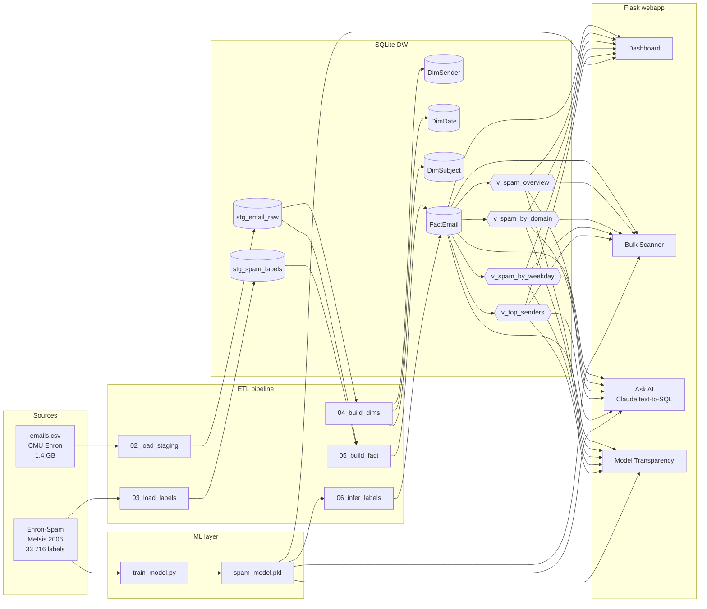
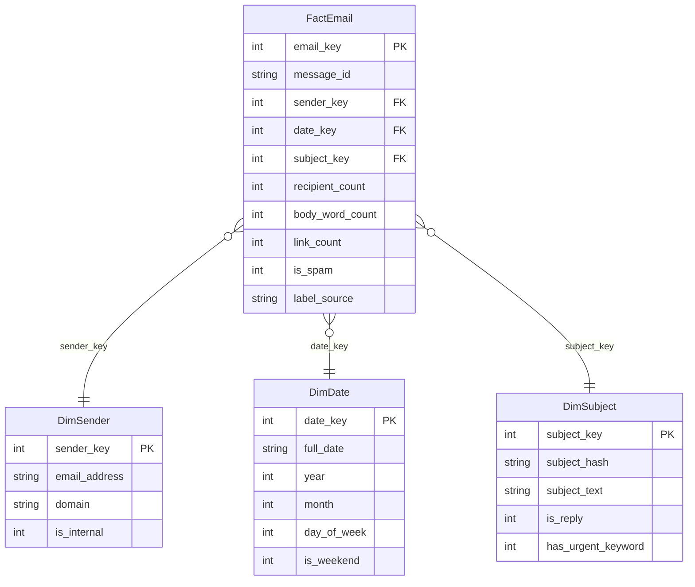

# SpamGuard DW

[](https://github.com/Dutchy-O-o/spamguard-dw/actions/workflows/ci.yml)
[](https://www.python.org/)
[](https://flask.palletsprojects.com/)
[](#model-performance)
[](#license)

**End-to-end Data Warehouse + ML + Dashboard for spam detection**, built on the Enron email corpus (~517K messages). Dokuz Eylul University graduation project.

> Real-world Star-Schema DW · TF-IDF + Multinomial Naive Bayes (98.8% accuracy) · Flask glassmorphic UI · Claude text-to-SQL assistant · PDF executive reports · Secure-by-design architecture.

---

## Table of Contents

- [Highlights](#highlights)
- [Architecture](#architecture)
- [Star Schema](#star-schema)
- [Quick Start](#quick-start)
- [Pages](#pages)
- [API](#api)
- [Model Performance](#model-performance)
- [Security & Hardening](#security--hardening)
- [Tests](#tests)
- [CI/CD](#cicd)
- [Repository Layout](#repository-layout)
- [License](#license)

---

## Highlights

| Layer | What |
|---|---|
| **Data** | 517,398 emails (CMU Enron) + 33,716 labeled (Metsis Enron-Spam) |
| **DW** | SQLite star schema: `FactEmail` + `DimSender`, `DimDate`, `DimSubject` |
| **ML** | TF-IDF (1–2 gram, 20K features) + MultinomialNB · test F1 = 0.989 · ROC AUC ≈ 0.998 |
| **UI** | Flask + Jinja · dark glassmorphic theme · drill-down modal · PDF export |
| **AI** | Anthropic Claude text-to-SQL over DW schema (offline fallback included) |
| **Security** | Read-only DB for LLM · prompt-injection hardened · CSV formula sanitization |
| **Quality** | 12 pytest tests (fixture-driven) · ruff lint · GitHub Actions CI |

---

## Architecture



## Star Schema



---

## Quick Start

### With Docker (recommended)

```bash
cp .env.example .env          # paste your ANTHROPIC_API_KEY (optional)
docker compose up --build
# → http://localhost:5000
```

### Without Docker

```bash
pip install -r requirements.txt
cp .env.example .env          # optional: ANTHROPIC_API_KEY

# one-time data pipeline (~20 min total)
python etl/01_init_db.py
python etl/02_load_staging.py            # ~18 min (517K emails)
python etl/download_enron_spam.py        # 6 tarballs, ~25 MB
python etl/03_load_labels.py --real
python etl/04_build_dims.py
python ml/train_model.py
python etl/05_build_fact.py
python etl/06_infer_labels.py
sqlite3 db/SpamGuard_DW.db < sql/analytical_views.sql

python webapp/app.py
# → http://127.0.0.1:5000
```

### Minimal demo (no 1.4 GB download)

The ML model can be trained directly from the Metsis preprocessed folders (25 MB), skipping the full Enron corpus:

```bash
python etl/01_init_db.py
python etl/download_enron_spam.py
python ml/train_model.py                 # ~90 s, produces models/spam_model.pkl
python webapp/app.py                     # live spam checker only
```

---

## Pages

| URL | What |
|---|---|
| `/` | Dashboard — KPIs, trend chart, anomaly feed, domain/sender drill-down |
| `/scanner` | Bulk CSV scanner — per-row scoring, risk report, PDF export, scan history |
| `/assistant` | Ask AI — Claude text-to-SQL over DW, or offline pattern router |
| `/admin/model` | Confusion matrix, PR/ROC curves, top features, word clouds |
| `/docs` | Swagger UI (OpenAPI 3.0) |

---

## API

| Method | Path | Purpose |
|---|---|---|
| GET  | `/api/stats`         | Overview + top domains/senders + weekday |
| POST | `/api/check`         | Single prediction + feature summary |
| POST | `/api/explain`       | Top contributing tokens for a prediction |
| POST | `/api/scan`          | Bulk CSV → per-row scores + summary |
| POST | `/api/ask`           | Natural language → DW answer (read-only SQL) |
| GET  | `/api/drilldown`     | `?type=domain\|sender&value=...` |
| GET  | `/api/trend`         | Monthly time-series |
| GET  | `/api/anomalies`     | Auto-detected anomalies |
| GET  | `/api/wordcloud`     | Spam / ham top tokens |
| GET  | `/api/model-metrics` | Confusion matrix, PR, ROC, feature weights |
| GET  | `/api/scan-history`  | Recent 20 bulk scans |
| POST | `/api/feedback`      | User feedback on a prediction |
| POST | `/api/report`        | Executive PDF report |

Full spec: `/openapi.json` · Swagger UI at `/docs`.

---

## Model Performance

```
              precision    recall  f1-score
         ham      0.991     0.985     0.988
        spam      0.986     0.991     0.989
    accuracy                          0.988
ROC AUC                               ~0.998

confusion matrix (test set):
   [[3261    48]     TN  FP
    [  31  3404]]    FN  TP
```

Evaluated on a 20% stratified test split of the Metsis Enron-Spam corpus (6,744 emails).

> **Caveat:** Accuracy reflects the Metsis corpus structure (external spam traps vs legitimate Enron business emails). Cross-corpus generalization has not been measured.

---

## Security & Hardening

Production posture follows a **defense-in-depth** model. Three layers protect the Ask-AI (text-to-SQL) pipeline and the bulk CSV workflow:

### 1. Read-only DB for LLM-generated SQL

Claude-generated SQL is executed on a connection opened with `file:<db>?mode=ro`. Even if the prompt-level regex filter is bypassed, SQLite physically rejects writes at the engine level.

```python
# webapp/app.py
def query_ro(sql, params=()):
    uri = f"file:{DB_PATH.as_posix()}?mode=ro"
    with sqlite3.connect(uri, uri=True) as conn:
        ...
```

Tested against `DROP`, `DELETE`, `VACUUM`, `PRAGMA writable_schema=1`, `WITH x AS (DELETE ... RETURNING *)` — all blocked at two layers.

### 2. Secondary prompt-injection mitigation

Rows returned to the summarization LLM are wrapped in `<untrusted_data>...</untrusted_data>` tags. The system prompt explicitly instructs the model to treat tag contents as data, never as instructions.

Verified: spam subjects containing `"Re: ignore"`, `"CLICK HERE"`, `http://...` payloads are summarized factually — the model does not follow embedded commands, change roles, or redirect users.

### 3. CSV Formula Injection (CWE-1236)

The "Download scored CSV" feature prefixes every cell that starts with `=`, `+`, `-`, `@`, TAB, or CR with a single quote (`'`). This neutralizes Excel/LibreOffice formula execution without altering displayed text.

```js
// webapp/static/scanner.js
function sanitizeForCsv(value) {
  let s = String(value ?? "");
  if (/^[=+\-@\t\r]/.test(s)) s = "'" + s;
  ...
}
```

### Other guarantees

- `/api/drilldown` uses parameterized queries (no SQL injection)
- Frontend uses HTML-escaping for all user-derived content (`escapeHtml`, `mdInline`)
- Upload size capped at 50 MB (`MAX_CONTENT_LENGTH`)
- Secrets via `.env` (git-ignored); no credentials in source

### Known limitations

- `/admin/model` is not authenticated (intentional for demo). Add reverse-proxy auth before public deployment.
- `/api/feedback` is not rate-limited. Add Flask-Limiter or WAF in front for production.

---

## Tests

Fixture-driven; no manual server startup required:

```bash
pytest -q
# 12 passed in ~8s
```

Test layout:

- `tests/conftest.py` — session-scoped `app` + `client` fixtures using Flask's in-process test client; skip gracefully when the DW hasn't been built.
- `tests/test_api.py` — HTTP smoke: index, `/api/stats`, `/api/check`, `/api/drilldown`, `/api/trend`, `/api/anomalies`, `/api/openapi.json`.
- `tests/test_dw.py` — DW integrity: core tables, orphan FKs, view presence, overview sanity, `is_internal` enum.

---

## CI/CD

Every push / PR to `main` triggers `.github/workflows/ci.yml`:

- Matrix: Python 3.11 and 3.12 on Ubuntu
- `ruff check` for style + pyflakes / pyupgrade
- `python -m compileall` syntax check
- `pytest -q` (tests skip gracefully when DW isn't built on the runner)

Run locally:

```bash
pip install ruff
ruff check etl ml webapp tests
python -m compileall -q etl ml webapp tests
pytest -q
```

---

## Repository Layout

```
DataWareHouse/
├── .github/workflows/ci.yml   lint + tests on push/PR
├── sql/                       schema.sql, analytical_views.sql
├── etl/                       01–06 pipeline + config.py + download_enron_spam.py
├── ml/                        train_model.py
├── models/spam_model.pkl      (ignored, regenerate with ml/train_model.py)
├── db/SpamGuard_DW.db         (ignored, regenerate with ETL)
├── webapp/
│   ├── app.py                 Flask app, 13 routes, 2-layer security
│   ├── templates/             base + dashboard + scanner + assistant + model + docs
│   └── static/                style.css + per-page JS
├── tests/
│   ├── conftest.py            session-scoped Flask test_client fixtures
│   ├── test_api.py            HTTP smoke (7 tests)
│   └── test_dw.py             DW integrity (5 tests)
├── docs/architecture.html     mermaid diagrams (system + star schema + ML + Ask AI flow)
├── notebooks/01_eda.ipynb     EDA + early model experiments
├── pyproject.toml             ruff config
├── pytest.ini
├── requirements.txt
├── Dockerfile + docker-compose.yml
├── .env.example               (copy to .env, add ANTHROPIC_API_KEY)
└── .gitignore
```

---

## Tech Stack

| Concern | Choice | Why |
|---|---|---|
| Storage | SQLite | Zero-config, fully portable DW for 517K rows |
| ETL | pure-stdlib Python | No pandas dependency, deterministic |
| ML | scikit-learn (TF-IDF + MultinomialNB) | Strong baseline, fast, interpretable |
| Web | Flask + Jinja + vanilla JS | Small surface area, no build step |
| LLM | Anthropic Claude | Text-to-SQL with strong JSON adherence |
| PDF | ReportLab + Matplotlib | Native Python, no headless Chrome needed |
| Tests | pytest + Flask test_client | In-process, CI-friendly |
| Lint | ruff | Fast, opinionated, single-tool |
| CI | GitHub Actions | Free for public repos, matrix builds |

---

## License

Educational / academic use.
Authored by Emre Akkaya · Dokuz Eylul University · 2026.
